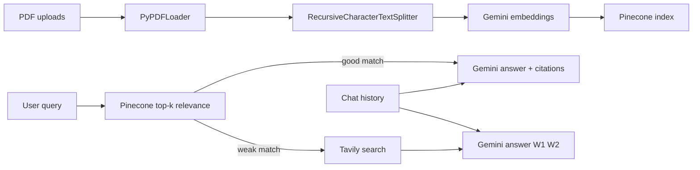

# Smart Research Assistant

A **production-style RAG (Retrieval-Augmented Generation)** app for a take-home or portfolio: upload PDFs, ask questions, get **answers with citations** (document name + page), **conversation memory**, **Gemini** as the LLM, **Pinecone** for vector search, and **Tavily** as a **web search fallback** when your PDFs do not match the query well.

## Why these tools?

| Choice | Reason |
|--------|--------|
| **LangChain** | Standard composable abstractions (loaders, splitters, vector stores, messages) without locking you into one vendor. Easy to swap vector DB providers later. |
| **Gemini** | Strong free/low-cost tier, fast latency, single Google AI Studio key for chat + embeddings. |
| **Pinecone** | Managed vector database with free tier, simple API key setup, and production-style hosted retrieval that matches assignment requirements. |
| **Tavily** | API designed for LLM agents; returns concise snippets + URLs. **Trade-off:** another API key and rate limits vs building your own crawler. |
| **Streamlit** | Fastest path to a clean upload + chat UI with loading states and session state. **Trade-off:** not a custom React SPA — good enough for internal tools and assignments. |

## Architecture



1. **Ingest:** PDFs → one `Document` per page (accurate page metadata) → chunk → embed → Pinecone.  
2. **Query:** Similarity search returns chunks + relevance-based scores.  
3. **Routing:** If the best distance is below a threshold, run **document RAG**; else **Tavily** + LLM with `[Wn]` style citations.  
4. **Memory:** Prior user/assistant turns are formatted into the prompt (last several turns).  
5. **Bonus:** **Retrieval confidence** is derived from retrieval score (heuristic, not a calibrated probability).

## Project structure

```
pdf-assistant/
├── .env.example           # Template for API keys
├── requirements.txt
├── streamlit_app.py       # Streamlit entrypoint
├── README.md
└── app/
    ├── __init__.py
    ├── config.py          # Settings (chunk sizes, thresholds, model names)
    ├── pdf_loader.py      # PDF → Documents with page + filename metadata
    ├── chunking.py        # RecursiveCharacterTextSplitter
    ├── embeddings.py      # Google Generative AI embeddings
    ├── vector_store.py    # Build / load Pinecone; similarity with scores
    ├── citations.py       # [1], [2] context blocks + reference lines
    ├── rag_pipeline.py    # Retrieve → prompt → Gemini; confidence heuristic
    ├── agent.py           # Tavily fallback + routing
    └── conversation.py    # Streamlit history → LangChain messages
```

## Chunking strategy (with reasoning)

- **Splitter:** `RecursiveCharacterTextSplitter` with separators `["\n\n", "\n", ". ", " ", ""]`.  
- **Chunk size:** **1000 characters**, **overlap 200**.

**Why:** For ~10-page PDFs, 1000 chars is roughly 150–200 tokens — large enough to keep a paragraph or proof step together, small enough that embeddings stay specific and retrieval noise stays low. **Overlap 200** reduces the chance that a sentence sitting on a chunk boundary is cut in half in *both* neighbors, which often hurts QA.  

**Trade-off:** Character count ≠ token count; for very dense math or tables you might prefer token-based splitting (`from_tiktoken_encoder`) or smaller chunks.

## Retrieval approach

- **Similarity search:** Pinecone cosine similarity with Gemini embeddings.  
- **Top-k:** `k=5` (configurable in `app/config.py`). Five chunks usually cover multi-aspect questions without blowing the context window.  
- **Scores:** Pinecone returns relevance (higher is better). In code, we convert to pseudo-distance `1 - relevance` so routing logic can stay simple.  
- **Routing threshold:** `max_l2_distance` (default `0.55` after converting relevance to pseudo-distance). If `min(top-k distances) > threshold`, we assume the corpus is a weak match and call **Tavily**. Tune this after logging a few queries on your PDFs — different corpora need different cutoffs.  
- **Optional reranking:** Not implemented to keep the codebase small. A common upgrade is **Cohere Rerank** or a cross-encoder on `(query, chunk)` pairs after top-k. **Trade-off:** extra latency and API cost vs better precision@k.

## Citation implementation

- **Metadata on ingest:** Each chunk carries `document_name` (basename), `page` (1-based), and `source` (path while indexing).  
- **Prompt:** Retrieved chunks are shown as `[1] (filename.pdf, p. 3)\n<text>`. The system prompt asks Gemini to cite with `[1]`, `[2]`, etc.  
- **UI:** The sidebar lists the same references so users see **human-readable** pointers, not raw chunk text (though an expander shows short **source excerpts** for transparency).

## Agent / routing logic

1. **No vector store:** If Tavily is set, we answer from the web and **state that nothing is indexed** (not implied as coming from PDFs).  
2. **No chunks / weak retrieval** (`min(pseudo-distance) > max_l2_distance`): We **say the uploads don’t look sufficient**, then run **Tavily** and append a normal web-synthesized answer (not a dead end).  
3. **Strong retrieval:** We run RAG. If the model decides the PDFs still can’t answer, it ends with a hidden line `__DOC_INSUFFICIENT__`. The agent **strips that marker**, keeps the user-visible “documents don’t contain enough…” text, runs **Tavily**, and adds a **“From web search”** section via a second LLM call (`run_web_after_doc_gap`).  
4. **Web snippets** are labeled `[W1]`, `[W2]` in the prompt; Tavily must be configured for the full agent fallback.

This stays simpler than a full ReAct loop but matches **“admit the doc gap, then try the web”** behavior.

## Problems we hit while wiring this stack (honest notes)

- **Duplicate retrieval calls** — First draft ran similarity search in the agent and again inside RAG. We added `precomputed_pairs` to `run_rag` so routing and generation share one retrieval pass (less latency, easier to reason about scores).  
- **LangChain Tavily wrapper kwargs** — Wrapper parameters change across versions; calling **`tavily-python`’s `TavilyClient` directly** keeps behavior stable for reviewers.  
- **Streamlit secrets vs `.env`** — Community Cloud injects `st.secrets`, not always `os.environ`. We **`_hydrate_streamlit_secrets()`** at startup so `pydantic-settings` reads the same keys locally and in the cloud.

## Problems you might hit (and fixes)

| Issue | Fix |
|-------|-----|
| `GOOGLE_API_KEY` invalid | Create a key in [Google AI Studio](https://aistudio.google.com/apikey); ensure billing/quota if using paid models. |
| Chat model `404 NOT_FOUND` | Older IDs (`gemini-1.5-flash`, etc.) are removed from the current API. Default is `gemini-2.5-flash`; set `CHAT_MODEL` in `.env` or see [Gemini models](https://ai.google.dev/gemini-api/docs/models/gemini). Try `gemini-flash-latest` if a stable name changes. |
| Embedding `404 NOT_FOUND` for `text-embedding-004` | The Developer API expects current embedding IDs (default in repo: `gemini-embedding-001`). Set `EMBEDDING_MODEL` in `.env` if you need another listed in the [embeddings docs](https://ai.google.dev/gemini-api/docs/embeddings). Rebuild the index after any embedding change; delete `data/` if you hit dimension errors. |
| Pinecone index creation fails | Check `PINECONE_API_KEY`, cloud/region, and index name; ensure free-tier project is active and retry build. |
| Distances always “bad” | Your threshold may be miscalibrated. Log `pairs` from `similarity_search_with_score` and adjust `max_l2_distance`. |
| Empty PDF text | Scanned PDFs need OCR (e.g. Tesseract, Document AI) — out of scope here; add a note in the UI. |
| Streamlit Cloud secrets | Add `GOOGLE_API_KEY` and `TAVILY_API_KEY` in app secrets (see Deployment). |
| `429 RESOURCE_EXHAUSTED` / quota on `gemini-2.5-flash` | Free tier has strict per-minute/per-day limits on **generate_content**. The app **retries** after the server’s suggested wait. Reduce chat calls (fewer agent steps), wait a minute, try **`CHAT_MODEL=gemini-2.5-flash-lite`** for a separate quota bucket, or enable billing / upgrade in [Google AI](https://ai.google.dev/gemini-api/docs/rate-limits). |

## Future improvements

- Hybrid search (BM25 + dense) for keyword-heavy queries.  
- Reranking API on top-k.  
- Pinecone / Supabase pgvector for persistent multi-user indexes.  
- OCR pipeline for scanned PDFs.  
- Stricter “answer only from context” with small classifier or logprobs.

---


